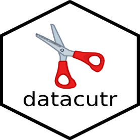

# datacutr 

SDTM Datacut in R

<!-- badges: start -->

<!-- note: insert datacutr shield here when ready -->
[](https://pharmaverse.org)
<!-- note: insert CRAN Status here when ready -->
<!-- note: insert Test status here when ready -->
[](https://github.com/pharmaverse/datacutr/blob/badges/devel/test-coverage.svg)
[](https://CRAN.R-project.org/package=datacutr)
<!-- badges: end -->

## Purpose

To provide an open source tool that enables the pharmaceutical programming community
to apply a data cut to SDTM data in R.

## Installation

The package is available from CRAN and can be installed by running the following,

```r
install.packages("datacutr")
```

To install the latest development version of the package directly from GitHub use the following code::

```r
if (!requireNamespace("remotes", quietly = TRUE)) {
  install.packages("remotes")
}

remotes::install_github("pharmaverse/datacutr", ref = "devel")
```

## Scope
 
This package works with tabulation data following an SDTM standard. For ease of processing, the assumption is that supplemental qualifiers have been combined with their parent domain prior to the application of the cut process (sometimes labeled as SDTMv). The user has the flexibility to select the type of cut applied to each SDTM domain (either no cut, patient cut, date cut, or a special DM cut).

## References and Documentation

* Please go to [Get Started](https://pharmaverse.github.io/datacutr/articles/datacutr.html) section to start using `{datacutr}`
* Please go to [Function Reference](https://pharmaverse.github.io/datacutr/reference/index.html) section for a break down of all functions created by `{datacutr}`
* Please see the [Contribution Model](https://pharmaverse.github.io/datacutr/articles/contribution_model.html) for how to get involved with making contributions

## Contact

The following support and communications between user and developer community is recommended:

* [Slack](https://app.slack.com/client/T028PB489D3/C02M8KN8269) - for informal discussions, Q\&A and building our user community. If you don't have access, use this [link](https://join.slack.com/t/pharmaverse/shared_invite/zt-yv5atkr4-Np2ytJ6W_QKz_4Olo7Jo9A) to join the pharmaverse Slack workspace
* [GitHub Issues](https://github.com/pharmaverse/datacutr/issues) - for direct feedback, enhancement requests or raising bugs
